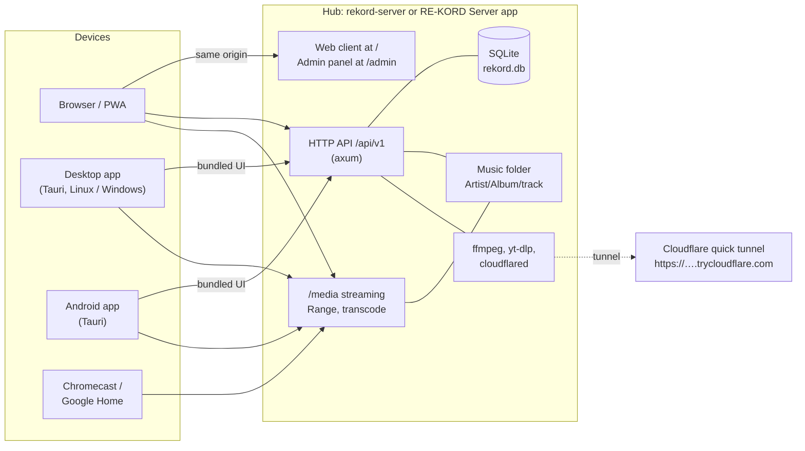

# Architecture

RE-KORD 5 is a Rust hub, a Svelte client and a Tauri 2 shell. It replaces the legacy
React / Node / Electron / Capacitor app with one hub binary, one client codebase, and
native shells that package that client for desktop and Android.



## Repository layout

| Path | Package | Role |
|---|---|---|
| `crates/core` | `rekord-core` | The hub as a library: HTTP API, database, scanner, media, Studio, metadata, backup, remote access. Embeddable (`run_hub`). |
| `crates/plugin-api` | `rekord-plugin-api` | Module manifest types (see [MODULES.md](MODULES.md)). |
| `apps/server` | `rekord-server` | The standalone hub binary: CLI flags, environment variables, one-shot restore / legacy sync. |
| `apps/client-ui` | `@rekord/client-ui` | The client: Svelte 5 + TypeScript + Vite. Player, library, Studio, Plectr, statistics, settings. |
| `apps/server-ui` | `@rekord/server-ui` | The admin panel served at `/admin`. |
| `apps/client-shell` | `@rekord/client-shell`, crate `rekord-client` | Tauri 2 shell for desktop and Android. With the `hub` feature it becomes **RE-KORD Server**. |
| `packages/ui` | `@rekord/ui` | Shared design system: Button, Panel, Field, Tabs, CoverArt, BrandLogo, QR code, fonts. |
| `scripts/` | | Packaging (`pack.sh`, `pack-macos.sh`), Android build, tool fetchers, version sync, systemd files, Docker builder image. |
| `modules/`, `modules.manifest.toml` | | Reserved module manifest (see [MODULES.md](MODULES.md)). |
| `Dockerfile`, `docker-compose.yml` | | Hub container. |

## The hub

`rekord-core` is an [axum](https://github.com/tokio-rs/axum) application on Tokio.
`rekord-server` and the RE-KORD Server desktop app both call `rekord_core::run_hub`; the
desktop app runs it on its own thread and runtime, so the window never waits for it.

| Area | Modules | Notes |
|---|---|---|
| API and routing | `api.rs`, `studio.rs` | JSON envelope `{ ok, data }` / `{ ok: false, error, message? }`, stable error codes. See [API.md](API.md). |
| Security | `origin.rs`, `perm.rs` | Browser origin policy, local vs remote requests, library and machine operations. See [SECURITY.md](../SECURITY.md). |
| Library database | `db/` | SQLite (bundled `rusqlite`), WAL, schema migrations via `PRAGMA user_version`, FTS search, curated vs tag values, normalised genres. |
| Scanner | `scan.rs`, `layout.rs`, `watcher.rs`, `embedded/` | Folder-first incremental scan, layout detection, embedded tags and covers for every format (one read per file, Studio values win), the resumable embedded-tags backfill job, exact MP3 durations, filesystem watcher with coalesced rescans. |
| Media | `media.rs`, `transcode.rs`, `cover.rs`, `thumbs.rs` | Range/ETag streaming, synthetic Xing headers, cached FLAC conversions, live MP3/AAC transcodes for Cast, cover thumbnails. |
| Accounts and personal data | `accounts.rs`, `user_state.rs`, `selection.rs`, `track_moods.rs` | Profiles, per-account user state with optimistic revisions (HTTP 409 on conflict), library selection, moods. |
| Studio | `downloads.rs`, `ytdlp*.rs`, `youtube_music.rs`, `catalog_preview.rs`, `studio_fs.rs` | yt-dlp downloads as observable jobs, YouTube Music search, Discover previews, folder operations. |
| Metadata | `metadata/`, `entity_info.rs` | Discogs, MusicBrainz, iTunes, Deezer, TheAudioDB, LRCLIB, Cover Art Archive; curiosità from Wikipedia, Wikiquote, Last.fm, Discogs, TheAudioDB. |
| Backup | `backup/` | Backup ZIP v3 export/restore, legacy v2 restore, one-time legacy import, legacy config import. |
| Operations | `jobs.rs`, `diagnostics.rs`, `errors.rs`, `tools.rs` | Job registry, activity log, recent-errors buffer, discovery and update of external tools. |
| Remote access | `remote_access.rs` | LAN URL detection and the Cloudflare quick tunnel. |
| Power | `power/` | "Prevent the computer from sleeping": systemd-logind inhibitor (Linux), `SetThreadExecutionState` (Windows), `caffeinate` (macOS). Event driven: activity guards and one grace timer, nothing at all while off. |
| Podcasts (optional) | `podcasts/` | "Podcast e notizie": feed / page / play.rtl.it / yt-dlp / live-stream sources fetched on demand with a TTL, and a Range-capable audio proxy limited to configured episodes. Off by default. See [MODULES.md](MODULES.md). |

### Data on disk

```
<data dir>/                    REKORD_DATA_DIR
  rekord.db                    library index, favorites, playlists, metadata
  settings.json                hub settings (music folder, integrations, remote admin)
  accounts.json                account registry
  accounts/<id>/               per-account library selection
  accounts/<id>_info/          per-account user state, theme background
  thumbs/<size>/               cover thumbnails
  covers/embedded/             covers taken from the files (albums without a folder image)
  cache/transcode/             FLAC copies of WMA / AIFF / ALAC (LRU, 2 GiB)
  cache/podcast-art/           podcast artwork thumbnails (optional module)
  tools/yt-dlp                 yt-dlp installed by "update yt-dlp"
  legacy-import.json           outcome of the one-time legacy import

<music folder>/
  Artist/Album/01 - Title.flac
  .kord/                       layout, sidecars, legacy library data
```

### Request flow

- **UI**: the hub serves the built client at `/` and the admin panel at `/admin`. A
  browser on the LAN or through the tunnel therefore talks to the API on the same origin.
- **Desktop and Android** carry their own copy of the client. They talk to the hub
  cross-origin from `tauri://localhost` or `http://tauri.localhost`, which the origin
  policy allows explicitly.
- **Compatibility**: `/api/v1/health` reports `version`, `apiVersion` and
  `minClientVersion`. Native clients compare them with their own version and show an
  update banner, or a blocking warning when they are too old for the hub.

## The client

`apps/client-ui` is a single-page Svelte 5 app with lazy-loaded views and locale chunks.

- **State**: runes-based stores in `src/lib/*.svelte.ts`. Personal state (queue, settings,
  play counts, moods) syncs to the hub per account, with revision-based conflict handling.
- **Player**: two decks for crossfade and near-gapless playback, a lazily created Web Audio
  graph for visualizers and fades, Media Session integration, and automatic fallback to
  the hub's FLAC transcode for formats the engine cannot decode.
- **Cast**: a Google Cast web sender in Chrome-family browsers (secure context) and a
  native sender in the Android app, behind one `CastBackend` interface
  (`src/lib/cast/`).
- **Platform layer** (`src/lib/platform/`): version compatibility, PWA and service worker,
  file saving inside the shells, external links.
- **i18n**: Italian (reference and fallback), English and German, with parity tests. See
  [TRANSLATIONS.md](TRANSLATIONS.md).

## The shells

`apps/client-shell/src-tauri` builds three products from one crate:

| Product | Identifier | Build |
|---|---|---|
| RE-KORD (desktop client) | `app.rekord.client` | `pnpm build:client` |
| RE-KORD Server (client + embedded hub) | `app.rekord.server` | `pnpm build:client:server-flavor` (`--features hub`) |
| RE-KORD for Android | `app.rekord.client` | `pnpm android:build` / `pnpm pack:android` |

The desktop shell adds a strict CSP, a single-instance lock, native save dialogs for
backups and theme exports, and opens external links in the system browser. The Android
project in `src-tauri/gen/android` is versioned and patched by hand: a foreground media
service, notification and lock-screen controls, audio focus, native Google Cast, QR
scanning and file saving. See [ANDROID.md](ANDROID.md).

## Build and packaging

`scripts/pack.sh` produces every package for Linux, Windows and Android. Linux and
Windows builds run inside a Docker builder image (`scripts/docker/builder.Dockerfile`,
Ubuntu 24.04 with WebKitGTK, GStreamer and cargo-xwin), so the host only needs Docker. See
[development.md](development.md#packaging).
