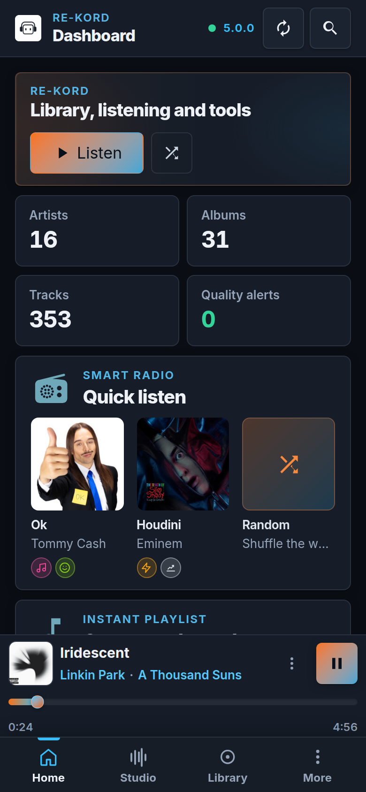
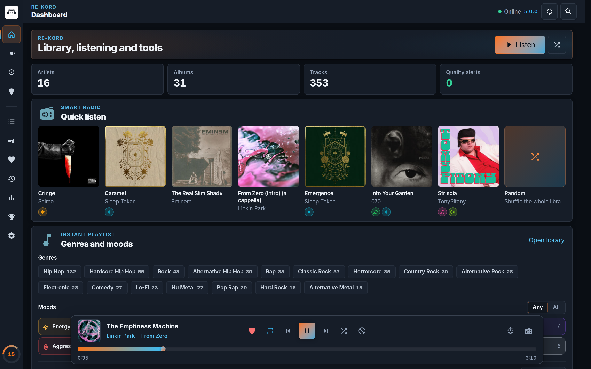
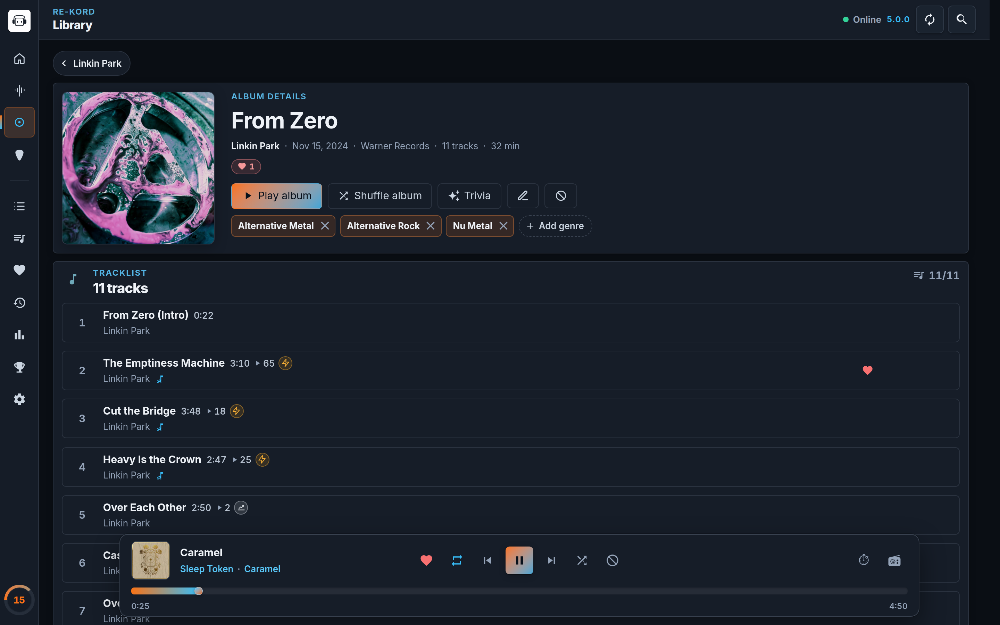
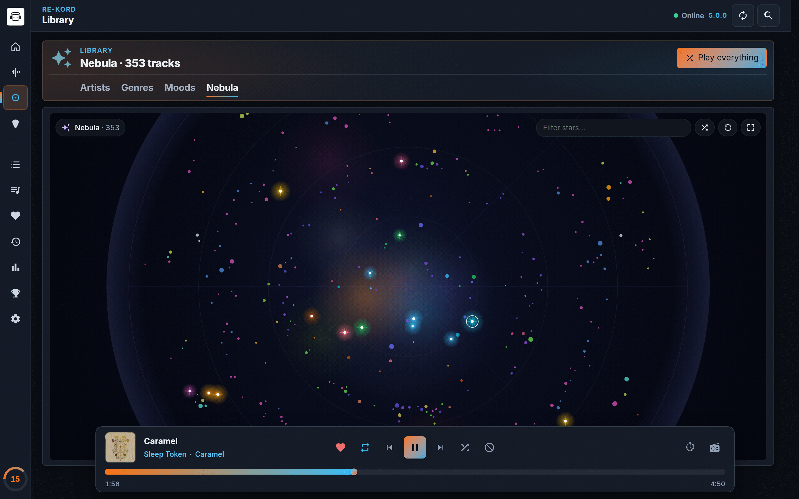
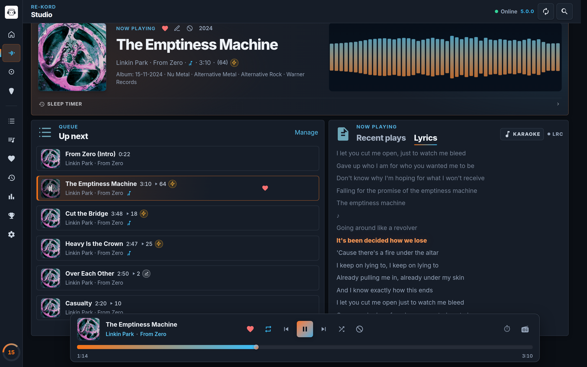
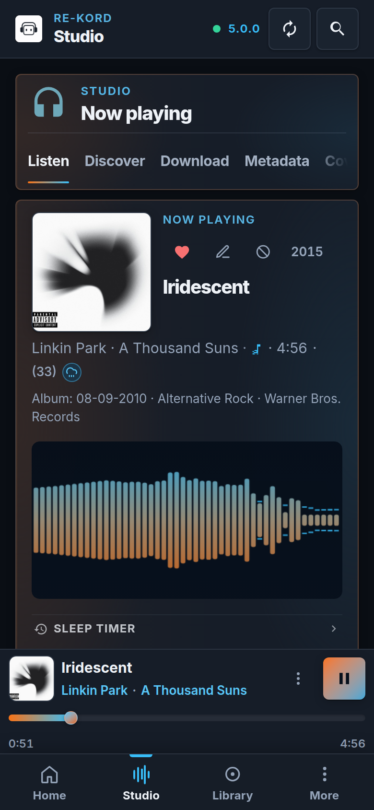
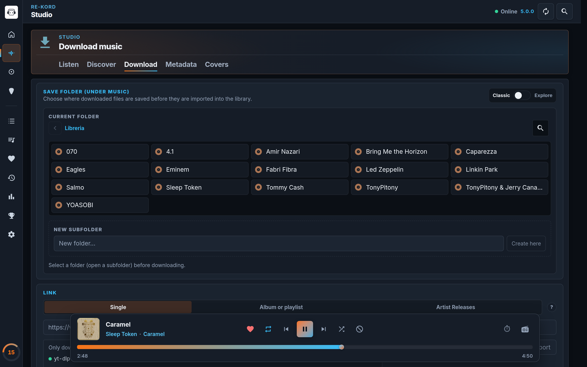
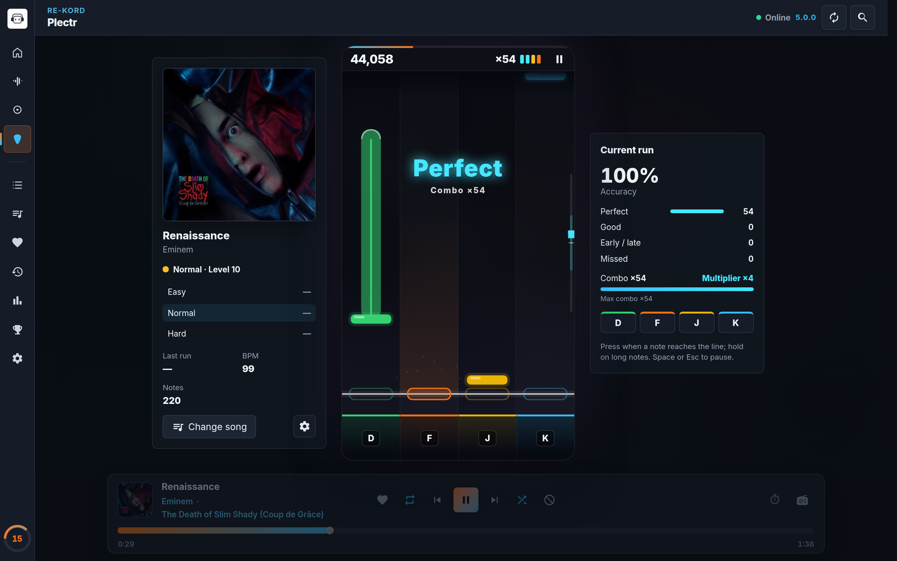

# RE-KORD user guide

Everything you can do in RE-KORD 5, view by view. Labels are quoted as they appear in the
English interface.

- [Concepts](#concepts)
- [Connecting a device](#connecting-a-device)
- [Getting around](#getting-around)
- [Home](#home)
- [Library](#library)
- [Search](#search)
- [Playing music](#playing-music)
- [Queue, playlists, favorites and recent](#queue-playlists-favorites-and-recent)
- [Studio › Listen: lyrics, visualizers and the sleep timer](#studio--listen-lyrics-visualizers-and-the-sleep-timer)
- [Cast](#cast)
- [Studio](#studio)
- [Plectr](#plectr)
- [Statistics](#statistics)
- [Achievements](#achievements)
- [Podcasts & news](#podcasts--news)
- [Settings](#settings)
- [Accounts and profiles](#accounts-and-profiles)
- [Remote access](#remote-access)
- [Backup and restore](#backup-and-restore)
- [The admin panel](#the-admin-panel)
- [Troubleshooting](#troubleshooting)

## Concepts

- **The hub** runs on the computer that holds your music. It indexes the music folder,
  stores accounts and personal data, and streams audio to every device. It is either the
  **RE-KORD Server** desktop app or the headless `rekord-server` (see
  [install.md](install.md)).
- **Clients** are the RE-KORD desktop app, the Android app and any web browser. They all
  show the same interface and talk to the hub over your network.
- **Accounts** (profiles) live on the hub. Each one has its own favorites, playlists,
  moods, statistics, theme and Plectr records. The music folder is shared.
- **The admin panel** at `http://<hub>:7420/admin` manages the hub itself: music folder,
  scans, backups, credentials and network access.

## Connecting a device

### In a browser

Open `http://<hub-ip>:7420/`. The hub serves the client, so there is nothing to set up.
The admin panel shows the hub's address under **Network › Local network access**.

### In the desktop app

On the computer running RE-KORD Server, the window connects to its own hub by itself. The
RE-KORD Client app first tries a hub on the same computer; if nothing answers, it shows the
connect screen.

### In the Android app, or when nothing answers

The connect screen has two steps.

1. **"Connect to the hub"**. Choose the **"Connection type"**:
   - **"Local network"**: enter the hub's **"IP or hostname"** (for example
     `192.168.1.20`) and **"Port"** (`7420`).
   - **"Public URL"**: the tunnel address, such as `https://name.trycloudflare.com`.

   Then choose **"Connect"**. On Android, **"Scan the QR"** opens the camera: scan the QR
   code shown in the admin panel (**Network › Local network access › QR**) or in the
   client's *Settings › Network › Remote access*. The address is filled in for you.
2. **"Choose an account"**: tap your profile. A hub with a single account skips this step.

The language switcher at the top of the screen changes the interface language right away.
To connect to a different hub later, use *Settings › Network › "Change hub"*.

## Getting around

### Navigation

On a wide window (1000 px or more), the **icon rail** on the left has two groups:

- "Home", "Studio", "Library", "Plectr"
- "Queue", "Playlists", "Favorites", "Recent", "Statistics", "Achievements", "Settings"

At the bottom of the rail, a ring shows your level; click it to open Achievements. The
Studio icon animates while music plays.

On a phone, the **bottom bar** has "Home", "Studio", "Library" and "More". "More" opens a
sheet with the other sections. The Android Back button closes open dialogs first, then
walks back through the sections you visited.

### Top bar

- The page title and the hub status: "Online", "Indexing…", "Connecting…" or "Hub
  offline". When offline, click the status to retry, or use "Change hub".
- **"Sync"** rescans the music folder and refreshes the library.
- **"Search (Ctrl+K)"** opens [Search](#search).

If the hub goes away, playback stops with "Hub unreachable…" and resumes where it stopped
when the hub is back ("Hub reachable again…").

### Update notices

The desktop and Android apps carry their own copy of the interface, so they can fall out of
step with the hub. A banner tells you what to do:

| Banner | Meaning |
|---|---|
| "Update available" | The hub is newer than this app. Everything works; download the new app when convenient. |
| "Update this app" | The hub needs a newer app; some features may not work until you update. |
| "Update your hub" | The hub is older than this app. Update the hub to get every feature. |
| "New version" | (Browser) the hub was updated: "Reload" to use the new interface. |

### Keyboard shortcuts

| Key | Action |
|---|---|
| `/` or `Ctrl+K` | Focus library search |
| `Space` | Play / pause |
| `←` / `→` | Back / forward 15 seconds |
| `I` | Go to Studio › Listen |
| `S` | Toggle shuffle |
| `P` | Open Plectr |

Shortcuts are off while you type, while a dialog is open and during a Plectr run. The list
is also in *Settings › Interface › "Shortcuts"*.

## Home

The dashboard is the starting point.

- **Hero card**: **"Listen"** (or **"Resume listening"**) picks up where you left off, or
  starts a library shuffle when nothing is loaded, and opens Studio › Listen. The shuffle
  icon, **"Play library"**, starts a fresh shuffle.
- **Tiles**: "Artists", "Albums", "Tracks" and "Quality alerts".
- **Smart Radio, "Quick listen"**: large cover tiles picked from your recent tracks, your
  favorites and the rest of the catalog (one per album). Tap a tile to start a radio from
  that track: the seed, then the library ordered by similarity (shared moods and genres,
  with a small bonus for the same artist). Recently played tracks go last and the same
  artist is spread out. The last tile, **"Random"**, shuffles the whole library. Click
  "Home" again for new picks.
- **"Instant playlist", "Genres and moods"**: pick genres and/or moods, then **"Shuffle
  the selection"**. Multi-genre tracks count for each of their genres.
- **"Nebula", "The universe of your music"**: a live preview of
  [Sonic Nebula](#nebula). Click it to open the Nebula full screen.
- **"Updated albums"**: the 12 most recently changed albums. Badges flag missing metadata,
  favorites and shuffle blocks.
- **"Favorites", "Quick picks"**: your most played favorites.
- **"Library quality", "Alerts and maintenance"**: albums without cover art or metadata,
  tracks without metadata, and folders with loose tracks. **"Go to Studio"** opens Studio ›
  Metadata to fix them.

If the library is empty, the dashboard tells you why: either the hub has no music folder yet
(set it in the admin panel), or your account has not selected any artists yet. New accounts
start empty: add artists and albums in Studio › Discover › Local.

## Library

The Library has four tabs: **"Artists"**, **"Genres"**, **"Moods"** and **"Nebula"**.
**"Play everything"** in the toolbar plays the whole library.

### Artists

A grid of artists, sortable by **"Name"** or **"Plays"** (remembered per account).

An **artist page** lists the albums, sortable by **"Date"**, **"Name"** or **"Plays"**, with
**"Play artist"** and **"Trivia"**.

### Albums

An **album page** shows the cover, the track count and duration, and:

- **"Play album"** and **"Shuffle album"**;
- **"Edit album"**: "Album name", "Release date", "Label", "Country", and a "Discogs"
  section (format, catalog number, release link) when the album was matched on Discogs;
- **"Edit cover"**: drop an image or choose a file (JPEG, PNG or WebP); it is saved as
  `cover.jpg` in the album folder;
- **"Shuffle block"**: keeps the whole album out of shuffles and radios;
- **"Trivia"**: notes about the album, if any were saved in Studio;
- **genre chips**: a genre present on only some tracks shows how many; click it to add it to
  the rest. Remove a genre with **×**, or add one with **"Add genre"**.

When the hub knows how many tracks an album should have, a hint shows how many are missing.
Albums made of loose files are labelled **"Loose tracks"**.

### Track actions

Every track row has:

| Action | What it does |
|---|---|
| "Play" | Plays from this track |
| "Play next" | Inserts the track after the current one ("in queue" / "remove" when already queued) |
| "Favorite" | The heart |
| "Playlists" | Adds the track to a playlist |
| "Edit track metadata" | Opens the track editor |
| "Block from shuffle" | Keeps the track out of shuffles and radios |

The row also shows the play count and a lyrics indicator ("Synced lyrics (LRC) available" or
"Lyrics available (not LRC)"). On narrow screens these actions are in **"More track
actions"**.

### Editing a track

**"Edit track details"** has:

- **"Title (display)"**, **"Release date"**;
- **"Genres"**: search your library's genres or type a new one;
- **"Mood"**: up to three of the fourteen moods (see [Moods](#moods));
- **"Lyrics"**: **"Edit"** to type or paste lyrics, **"Auto LRC"** to fetch synced lyrics
  from LRCLIB. When no synced version exists, plain lyrics are saved instead.

Fields you edit by hand are protected: later rescans and metadata fetches never overwrite
them.

**"Delete from disk"** (in the track editor and the album editor) erases the file or the
album folder. Its favorites, playlist entries and play counts go with it. There is no undo.

### Genres

Genre tiles with cover mosaics; **"No genre"** is always first. A genre page has **"Play
genre"** and a sortable tracklist. Genres are normalised, so `hip-hop` and `Hip Hop` are the
same genre, and a track tagged `Hip Hop; Pop Rap` appears in both.

### Moods

Moods are personal tags, at most three per track, set in the track editor:

> Energy / boost · Party / dance · Chill / relax · Focus / study · Romantic / intimacy ·
> Sad / melancholy · Dark / tense · Aggressive / heavy · Dreamy / ethereal · Epic /
> cinematic · Nostalgia / retro · Fun / quirky · Soulful / groovy · Motivational

The Moods tab filters the library: tap one or more moods, choose **"Match"** "Any" or "All",
then **"Listen"**. Each mood button shows how many of your tracks carry it. Moods also feed
Smart Radio, the instant playlist and the Nebula's colors.

### Nebula

Sonic Nebula draws your library as a galaxy. Every track is a star:

- **angle**: tempo (BPM, from tags or estimated);
- **distance from the center**: energy, from calm in the middle to energetic at the edge;
- **color**: the first mood, else the genre, else the artist;
- **size**: play count; favorites are a little bigger.

Drag to explore and scroll (or pinch) to zoom. Click a star, then **"Play"** or **"Radio
here"**; double-click plays and Shift+click starts a radio. **"Filter stars…"**, **"Surprise
me"**, **"Reset view"** and **"Fullscreen"** are in the toolbar. On the keyboard, the arrows
pan, `+`/`-` zoom, `Enter` plays the selected star and `Esc` leaves full screen.

### Trivia

Artist and album pages have a **"Trivia"** button when notes were saved for them in
Studio › Metadata › "Info and trivia". Notes are shown in your interface language, with a
link to entries in other languages.

## Search

Press `Ctrl+K` or `/`, or use the search button in the top bar. Type part of an artist,
album, track or genre. Results are grouped into **"Artists"**, **"Albums"** and
**"Tracks"**, with filter tabs for each. Accents are ignored, every word matches as a
prefix, and file paths and leading track numbers never match.

## Playing music

### The player dock

The bar at the bottom appears once something is queued. It shows the cover, title, artist
and album (click the artist or album to open it, or the cover to open Studio › Listen).

On desktop:

| Control | Notes |
|---|---|
| "Favorite" | |
| "Repeat" | Cycles all → one → off |
| "Previous" | After 3 seconds, restarts the current track instead |
| "Play/Pause", "Next" | |
| "Shuffle" | See below |
| "Exclude from shuffle" | Shows "Excluded by the album" when the whole album is blocked |
| Cast | See [Cast](#cast) |
| Sleep timer | See [Sleep timer](#sleep-timer) |
| "Radio from track" | Starts a Smart Radio from the current track |

On a phone, the dock shows only Play/Pause: swipe it left or right for next and previous,
and find everything else under **"More track actions"**.

### Shuffle, Smart Radio and exclusions

- **Shuffle** keeps the current track and reorders the rest with smart shuffle: recently
  played tracks move to the end and tracks by the same artist are spread apart.
- **Smart Radio** builds a queue (up to 500 tracks) from a seed track: the most similar
  tracks by moods and genres first. Start one from a dashboard tile, from **"Radio from
  track"**, or from a Nebula star.
- **Exclusions**: tracks or whole albums blocked from shuffle are left out of shuffles and
  radios, unless you start one of them yourself. Statistics show them as "Kept out of
  shuffle".

### Playback details

- **Crossfade** is "3 seconds" by default; change it in *Settings › Interface › Player*.
  With crossfade off, the next track is preloaded for near-gapless playback.
- **Play counts** go up once you pass half of a track.
- **Formats**: WMA, AIFF and ALAC files are played through a lossless copy the hub
  prepares, so they seek normally. See [supported-formats.md](supported-formats.md).
- **Errors**: a track that will not load is skipped. After three failures in a row,
  playback stops and tells you why.
- **System media controls**: the lock screen, notification shade, keyboard media keys and
  headset buttons control RE-KORD. On Android, a media notification keeps playing with
  the screen off; unplugging headphones or a phone call pauses the music.

## Queue, playlists, favorites and recent

### Queue

**"Queue"** lists what plays next. Drag rows (or use the up and down arrows) to reorder,
remove tracks, **"Go to current track"**, **"Clear"**, or type a name and **"Save as
playlist"**. The queue is saved per account on the hub, so it follows you to other
devices.

### Playlists

Type a name under **"New playlist"** and choose **"Create"**. Each playlist has
**"Play"** and, under **"More actions"**, **"Add the playing track"**, **"Rename
playlist"** and **"Delete"**. Open a playlist to reorder its tracks. Tracks can also be
added from any track row (**"Playlists"**).

### Favorites

Your hearted tracks, most played first, with **"Play favorites"**.

### Recent

Your listening history, newest first, with **"Play recent"** and **"Clear history"**.
Podcast episodes appear here only when [Podcasts & news](#podcasts--news) has **"Show in
Recent"** on.

## Studio › Listen: lyrics, visualizers and the sleep timer

**Studio › Listen** is the full now-playing screen. Open it from the dock, with `I`, or from
"Listen" on the dashboard.

- **Cover and details**: **"Change album cover"**, "Favorite", "Edit metadata",
  "Exclude from shuffle", play count, moods, and the track and album dates.
- **Visualizer**: click to expand it (**"Expand visualizer"**).
- **"Up next"**: the next tracks; **"Manage"** opens the Queue.
- **"Recent plays" / "Lyrics"** tabs. The Lyrics tab opens on its own for tracks with lyrics.

### Lyrics and karaoke

Synced (LRC) lyrics scroll with the music; click a line to jump there. **"KARAOKE"** shows
the lyrics inside the visualizer instead. When a track has no lyrics, **"Edit / Auto LRC"**
opens the editor so you can fetch or type them.

### Visualizers

Choose the visualizer in *Settings › Interface › Player › "Visualizer"*:

| Mode | |
|---|---|
| "Bars" | Spectrum bars (the default) |
| "Mirror" | Mirrored spectrum |
| "Wave" | Oscilloscope |
| "Smooth wave" | Softened waveform |
| "H · M · B waves" | High, mid and bass as separate waves |
| "Signals" | Signal lines |
| "Karaoke" | Synced lyrics on the visualizer |
| "DiscoWall" | A pixel wall that lights up on beats detected in four frequency bands |

Colors follow your theme.

### Sleep timer

From the dock (⏱): **"15 min"**, **"30 min"**, **"60 min"** or **"Custom minutes"**. In
Studio › Listen the sleep timer card offers 15 minutes, 30 minutes, 1 hour, or any duration
from 1 minute to 12 hours. The volume fades out over the last 30 seconds, then playback
pauses. **"Cancel"** stops the timer.

## Cast

RE-KORD casts to **Google Cast** devices: Chromecast, Google Home, Nest speakers and
displays, and TVs with Chromecast built in.

| Where | Cast available |
|---|---|
| Android app | Yes (native; needs Google Play Services) |
| Chrome, Edge or another Chromium browser | Yes, when the page is served over HTTPS or from `localhost` |
| Desktop app, Firefox, Safari, plain `http://<lan-ip>` pages | No: the Cast button is hidden |

Click the Cast button in the dock, choose a device, and the queue continues on it. The dock
shows "Casting to <device>". The play controls, the Android notification and the volume
keys now control the receiver. Disconnect to resume locally at the same position.

- The receiver fetches audio from the hub directly, so it must reach the hub's LAN address
  (or the public tunnel URL). If you opened the client on `localhost`, RE-KORD sends the
  LAN address instead.
- FLAC, OGG, Opus and WAV are converted to MP3 on the fly when the hub has ffmpeg, because
  many receivers cannot play them.

## Studio

Studio is where the library grows and gets tidied. Its tabs are **"Listen"** (above),
**"Discover"**, **"Download"**, **"Metadata"** and **"Covers"**.

**Who can make changes.** Studio changes the files on the hub, so it is allowed from the hub
computer itself, or from any device once **remote administration** is turned on in the
admin panel (**Network › Machine operations**). Elsewhere the panes stay readable and
explain why actions are off.

### Discover

A switch between **"Local"** and **"Web"**.

- **Local** controls which artists and albums appear in *your* library. The Default
  account always sees the whole library. A new account starts with an empty library:
  search the global catalog and use **"Add to library"** / **"Remove from library"** on
  artists or single albums. An account set to include everything can switch back with
  **"Use manual selection"**. The files on disk are shared; only the selection is
  personal.
- **Web** lists new releases from YouTube Music (albums, EPs and singles) by artists you
  have, that are not in your library yet. **"Preview"** plays the first 30 seconds of a
  track; **"Download"** sends the release to the Download tab. **"Refresh new releases"**
  checks again.

### Download

Downloads use yt-dlp on the hub. Only download content you have the rights to.

1. **Choose the save folder** ("Save folder (under Music)"): browse, search or create a
   subfolder. Downloading an album needs an artist or album folder; "Artist Releases" needs
   the artist folder.
2. **Choose a mode**:
   - **"Explore"**: search YouTube Music for an artist, album or track, then
     **"Download"**, or list an artist's **"Releases"** and **"Download selected"**.
   - **"Classic"**: paste a **"Link"** and pick the **"Download type"**: "Single", "Album or
     playlist" or "Artist Releases" (the type is detected when you paste). YouTube,
     YouTube Music, SoundCloud and Bandcamp links work.
3. **"Download and import"**. Progress shows releases and tracks; **"Stop"** cancels. When
   it finishes, the folder is re-indexed and the new music appears in the library.

The download keeps running on the hub if you leave the tab; come back to see its progress.
The **"Log"** panel shows a summary of what was downloaded, already present or failed.

The yt-dlp strip shows the version in use. YouTube changes often: when yt-dlp is old,
**"Update yt-dlp"** installs the latest verified release on the hub. For age-restricted or
members-only content, add YouTube cookies (*Settings › Library › Integrations*, or the
admin panel's **Integrations**).

### Metadata

Pick an **"Artist"** and **"Album"**, or **"Fill from playback"** for the current track.

**"Essentials"**

- **Album metadata** from Discogs, MusicBrainz and iTunes, for the **"Selected album"**
  or as an **"Automatic scan"** over the whole library ("Only missing" or "Rescan
  everything"). When several Discogs releases match, choose the right one in **"Choose
  Discogs release"**.
- **Track metadata** (genres and dates) from Deezer, iTunes and TheAudioDB, for the
  selected album or with **"Scan all tracks"**.
- **"Clean orphan track meta"** removes stored metadata for files that no longer exist.

Hand-edited fields are never overwritten; the log lists the ones it left alone.

**"Optional"**

- **"File titles"** removes numbering, YouTube tags and artist prefixes from titles.
  **"Preview"** first, then **"Apply"**, for one album or the whole library.
- **"Info and trivia"** searches the web (Wikipedia, Wikiquote, TheAudioDB, Discogs, and
  Last.fm when configured) for stories about an artist and its albums, in your interface
  language. Pick an artist and a scope, **"Find info"**, edit the texts you want, then
  **"Save picked entries"**. Saved entries appear behind the **"Trivia"** button in the
  library. **"Use as artist photo"** turns an entry's image into the artist's picture.

A Discogs token gives better results and higher rate limits (see
[Integrations](#library-1)).

### Covers

Pick the **"Target album"**, then either drop an image (JPG, PNG or WebP, up to 15 MB) or
**"Search covers"** across iTunes, Deezer, Discogs and MusicBrainz, choose one and **"Save
cover"**. The cover is written into the album folder.

## Plectr

Plectr turns the song you are listening to into a four-lane rhythm game. The chart is
generated from the song's audio; the music keeps playing while it is prepared.

**Starting.** Open Plectr while a song plays and the game starts at once on that song, from
where it is: the music is never paused, rewound or restarted. When the next song starts, a
new chart follows it. If the song is paused, **"Play"** resumes it and the notes start. With
nothing in the player, or with **"Change song"**, pick from **"Song of the day"**,
**"Recently played"**, **"Your records"**, **"Up next"**, search, or **"Random"**.

**Difficulty.** "Easy", "Normal" or "Hard", switched at any time with the buttons on the
stage or the `1` `2` `3` keys: the new chart starts from the current point of the song.

**Playing.** Notes fall down four lanes; hit them when they reach the line, and keep holding
on long notes. The default keys are `D` `F` `J` `K` (presets "S D K L" and "Arrows", or remap
any key); on touch screens, tap the lanes (several fingers at once work). `Space`, `Esc`, the
pause button or Back pause the song; resuming is immediate. Pausing from the player bar or
media keys freezes the notes too.

| Judgement | Window | Points |
|---|---|---|
| "Perfect" | up to 60 ms | 300 |
| "Good" | up to 105 ms | 180 |
| "Early" / "Late" | up to 150 ms | 90 |
| "Miss" | | 0 |

Points are multiplied by the combo multiplier: ×1, plus one step every 12 hits, up to ×4.
"FC" marks a full combo and "AP" an all-perfect run.

**Results.** Accuracy, max combo, notes hit and the grade: S (95 %+), A (90 %+), B (80 %+),
C (70 %+), D, or F when a challenge run fails. A new best is saved as a record per song and
difficulty, on your account, on every device. Runs where too many notes were skipped do
not count. **"Save result image"** saves a shareable card.

**"Records"** lists your best runs, sortable by recent, score or title.

**"Settings"** (game settings):

- **"Note speed"** (0.8× to 1.6×);
- **"Latency calibration"** (±150 ms), with a tap-along **timing test**;
- **"Light stage"** for slower devices: automatic, always or never;
- **"Stage backdrop"**: none, bars or the cover;
- **"Keys"** and key letters on the pads;
- **"Vibration"** on misses and combo milestones, where supported;
- **"Challenge"**: the run ends if accuracy drops below 30 %;
- **"Reset Plectr records"** for this account.

Plectr results count toward [Statistics](#statistics) and [Achievements](#achievements).

## Statistics

**Statistics** ranks your listening four ways: **"Plays"**, **"Favorites"**, **"Blocked"**
(kept out of shuffle) and **"Plectr"**. Each shows the top 3 tracks, artists, albums and
genres; the Plectr tab also lists all records. **"At a glance"** sums up total plays, tracks
with plays, artists and albums touched, favorites, tracks kept out of shuffle and Plectr
tracks played. Click any row to open it in the library.

## Achievements

Listening earns experience points (XP):

| Activity | XP |
|---|---|
| Each play | 1 |
| Each favorite | 5 |
| Each playlist | 10 |
| Each artist played | 3 |
| Each track blocked from shuffle | 2 |
| Plectr | 1 per 25 notes hit, 10 per completed run, 20 per full combo, 50 per all-perfect, plus a grade bonus |
| Each badge | its own bonus |

XP raises your **level** and your **rank**, from KICKER through KRAFTER, KURATORE, KEEPER
OF RE-KORD, KONDUCTOR, KOMPONER, KREATOR, KONTROLLER and RE-KORDMASTER to KING OF RE-KORD.
The page also shows your **daily listening streak**.

The badge board has 65 badges in families: plays, favorites, playlists, artists, genres,
distinct tracks, albums, shuffle exclusions, devotion to one artist or one track, library
coverage, daily streaks and Plectr.

## Podcasts & news

An optional module, **off by default**: news bulletins, podcasts and live radio stations,
played in the normal player. While it is off nothing of it exists in the app (no menu
entry, no card) and the hub does no work for it.

**Turning it on and adding sources** happens in the admin panel, section **"Podcasts &
news"** (Default account on the hub computer, or remote administration on):

1. **"Turn on Podcasts & news"**. Clients show it at their next refresh.
2. Paste an address in **"Add a source"**, choose how many episodes to show (1–20,
   default 3) and press **"Test"**: the panel says what it found and lists the latest
   episodes. **"Add"** saves it. The name comes from the feed unless you type one.
3. In **"Sources"** rename a source (empty name: back to the feed's title), change its
   number of episodes, move it up or down, or remove it.

What an address can be:

| Address | Example | Shown as |
|---|---|---|
| A podcast's RSS / Atom feed | `https://feeds.npr.org/500005/podcast.xml` | latest episodes |
| A web page that points to its feed, an Apple Podcasts page, a WordPress site | `https://podcasts.apple.com/…/id1200361736` | latest episodes |
| A play.rtl.it programme archive | `https://play.rtl.it/archivio/1/podcast/info/giornale-orario/` | latest editions |
| A page yt-dlp can read (YouTube channel or playlist, many broadcaster sites) | `https://www.youtube.com/@BBCNews/videos` | latest entries |
| A live radio stream, or an `.m3u` / `.pls` playlist pointing to one | `https://somafm.com/groovesalad.pls` | a single **LIVE** item |

HLS radio streams (`.m3u8`) are not supported: look for an MP3 or AAC address of the same
station. An address on your local network is refused.

**Listening.** With the module on, Home has a **"Podcasts & news"** card and the
navigation a **"Podcasts & news"** section (on the phone under **"More"**). Each episode
shows when it was published ("2 hours ago"), its length and how much is left. Tap it to
play: it starts right after the current track, and the rest of your queue carries on
after it. **"+"** adds it to the queue instead; **"✓"** marks it as listened (or not).
A started episode resumes where you left it, and an episode heard to the end is marked
listened, on every device of your account (the last 200 episodes are remembered).

Live radio shows **LIVE** instead of a length and cannot be seeked. Episodes and radio
never count as plays: they stay out of statistics, achievements, the library history,
Smart Radio and Plectr, and crossfade is off around them. Favourites, exclusions and
the album / artist links of the dock do not apply to them. Visualizers work as usual.

**Refreshing.** The hub fetches a source only when someone opens the card or the
section, and reuses what it fetched for 30 minutes (**"Cache lifetime"** in the admin
panel). **"Refresh"** asks again now. Nothing is checked in the background.

**In Recent.** The switch **"Show in Recent"** in the Podcasts & news section adds a
"Podcasts and news you listened to" list to *Recent* for your account. It is off by
default.

## Settings

Settings has five tabs: **"Account"**, **"Interface"**, **"Library"**, **"Network"** and
**"System"**.

### Account

The accounts on this hub, with their level. Switch to another account, **"Rename"**,
**"Delete"** (not the Default account), create a **"New account"**, or **"Export profile"**
to save your personal data as a file. Creating, renaming and deleting accounts is possible
from the hub computer, or anywhere once remote administration is on. See
[Accounts and profiles](#accounts-and-profiles).

### Interface

- **"Language"**: Italiano, English or Deutsch.
- **"Theme"**:

  | Group | Themes |
  |---|---|
  | Dual color | Midnight (default), Neon, Prism Engine |
  | Dark | Slate, Dark Amethyst, Dark Citrus, Dark Carmine |
  | Color | Sunset, Aurora, Ember, Forest, Ocean, Rose |
  | Light | Slate, Amethyst, Citrus, Carmine |
  | Custom | Your own |

- **"Customize…"** opens the custom theme: four colors (background, sections, accent 1,
  accent 2), and a background color or image (JPEG, PNG, WebP or animated GIF; fit cover,
  contain, fill, repeat or center). **"Extract colors from image"** builds a matching palette
  from the picture. **"Accent wash on background"** adds a soft gradient.
- **Glass style**: semi-transparent cards, with an adjustable **"Glass opacity"**. The top
  bar, the player bar, the sidebar and the first card of each page are frosted (blurred);
  the cards further down are only see-through, which keeps scrolling fast.
- **"Export theme"** saves your look as a `.zip`; **"Upload theme"** applies a theme file
  from anyone, without touching other data.
- **"Player"**: **"Visualizer"** and **"Crossfade"** (off, 3 or 5 seconds).
- **"Shortcuts"**: the [keyboard shortcuts](#keyboard-shortcuts).

Theme and preferences are saved on the hub, so they follow your account to every device.

### Library

- **"Path (from server)"**, free space on the volume and the time of the last scan.
  **"Reload index"** rescans. The music folder itself is set in the admin panel.
- **"Integrations"**:
  - **"YouTube cookies"**: a `cookies.txt` (Netscape format) for yt-dlp, needed for
    age-restricted or members-only content.
  - **"Discogs"**: a personal access token from your Discogs developer settings, for
    richer metadata and artwork and higher rate limits.

  Only the Default account can change integrations, from the hub computer or with remote
  administration on.

### Network

- **"Server / Hub"**: the hub address this device uses, **"Save and connect"**,
  **"Reload"**, and **"Change hub"** to reopen the connect screen. **"Open the hub panel"**
  opens the admin panel.
- **"Remote access"**: see [Remote access](#remote-access).

### System

- **"Backup"**: **"Download backup"**, **"Restore…"**, and **"Import from legacy .kord
  folder…"**. See [Backup and restore](#backup-and-restore).
- **"Activity"**: what happened on the hub (scans, downloads, playlists, settings,
  restores...), filtered by day and source. Day history is reserved for the Default
  account; other accounts see the last 24 hours.
- **"Diagnostics"**: client version, library counts, uptime, active downloads and the
  yt-dlp version, with **"Update yt-dlp"**, **"Check connection"** and **"Copy report"** (to
  paste into a bug report).

## Accounts and profiles

- Every hub has a **Default** account, which cannot be deleted and always sees the whole
  library. You can add as many accounts as you like, for family members or for rooms
  ("Living room"). A new account starts with an empty library and picks its artists and
  albums in Studio › Discover › Local.
- Accounts have **no password or PIN**: anyone who can reach the hub can pick any account.
  Treat them as profiles, not as security.
- **Shared**: the music folder and its files, curated metadata, covers.
- **Per account**: library selection, favorites, playlists, play counts and history, moods,
  shuffle exclusions, theme and interface preferences, the queue, Plectr records,
  achievements and level.
- Changes sync through the hub. Switching accounts in another browser tab is picked up.
- The **Default account on the hub computer** is the administrator: it alone can change the
  music folder, credentials, backups and network access (see [SECURITY.md](../SECURITY.md)).

## Remote access

### On your home network

The hub is reachable at `http://<hub-ip>:7420` from any device on the same network. The
admin panel lists the addresses under **Network › Local network access** ("recommended"
first), each with a **QR** code for the Android app. The client shows the same in *Settings
› Network › Remote access* ("Estimated address on your network"). If phones cannot connect,
check the firewall ([install.md](install.md#network-and-firewall)).

### Away from home: the Cloudflare tunnel

RE-KORD can open a **Cloudflare quick tunnel** with the bundled `cloudflared`: no account,
no router configuration, and HTTPS included.

1. In the admin panel, **Network › Access from outside › Start tunnel** (or in the client,
   *Settings › Network › Remote access › "Start external access"*).
2. After a few seconds a **public address** like `https://<random-words>.trycloudflare.com`
   appears, with a QR code. Click the QR to copy the address.
3. Open that address in any browser, or enter it in the Android app as a **"Public URL"**.

The address changes every time the tunnel starts. **Anyone who knows it can use your hub**
(there are no passwords), so stop the tunnel when you do not need it. Over the tunnel the web
client can be installed as an app, and Cast works in Chrome.

If you already run your own HTTPS reverse proxy, set `REKORD_PUBLIC_URL` and RE-KORD shows
that address instead (see [DEPLOY.md](DEPLOY.md#reverse-proxy-and-https)).

## Backup and restore

A backup is a ZIP with the hub settings, accounts, favorites, playlists, personal data,
library metadata and the library's `.kord` folder. **Audio files are not included**: back
up your music folder separately. The ZIP also contains your Discogs token and YouTube
cookies, so keep it private.

- **Download**: admin panel **Backup › Download backup**, or *Settings › System › Backup ›
  "Download backup"*.
- **Restore**: admin panel **Backup › Restore from ZIP file…**, or *Settings › System ›
  "Restore…"*. The hub's settings, accounts and personal data are replaced; accounts are
  matched by name. Legacy RE-KORD backups are recognised automatically. The music folder
  must exist at the path recorded in the backup.
- **Theme files** exported from *Settings › Interface* are applied with **"Upload theme"**
  by any account; they change only that account's theme.

Backup and restore run from the hub computer with the Default account, or anywhere with
remote administration on. Moving from the legacy app is covered in
[upgrading-from-legacy.md](upgrading-from-legacy.md).

## The admin panel

Open `http://<hub>:7420/admin` (from the client: *Settings › Network › "Open the hub
panel"*). From another device the panel is read-only, unless remote administration is on.

| Section | What it does |
|---|---|
| **Status** | Service state, track/album/artist counts, last scan, active jobs, free space, uptime, folder watching. **"Update library"** starts a scan. |
| **Library** | **"Music folder"**: set the path, **"Update (changes only)"** or **"Rebuild everything"**. **"Library structure"**: **"Analyse folders"** and choose how folders are organised ("Artist / Album / Track", "Artist / Track", "Single folder", "File tags only"), and whether subfolders such as CD1 / CD2 are separate albums. **"Automatic updates"**: watch the folder and update on its own. **"Maintenance"**: rebuild cover thumbnails, import data from the previous version. A **scan report** lists what was read, indexed, skipped and removed. |
| **Jobs** | Scans, thumbnails, legacy syncs and restores, with progress and **"Cancel"**. |
| **Diagnostics** | Hub version, uptime, database, disk space, library structure, the external programs found (ffmpeg, yt-dlp, cloudflared) and recent errors. |
| **Activity** | The activity log, by day, for the hub and the accounts. |
| **Backup** | **"Download backup"**, **"Restore from ZIP file…"**, and **"Restore from the previous version"** (import from a legacy `.kord` folder). |
| **Accounts** | Create, rename, export and delete accounts. |
| **Integrations** | YouTube cookies for yt-dlp and the Discogs token. |
| **Podcasts & news** | Turn the optional module on or off, the cache lifetime, and the sources (add with a **"Test"** preview, rename, episodes per source, order, remove). See [Podcasts & news](#podcasts--news). |
| **Network** | **"Local network access"** (addresses and QR codes), **"Access from outside"** (Cloudflare tunnel, public IP) and **"Machine operations"**. |

**Updating the library safely.** "Update (changes only)" re-reads only what changed and
refuses to drop a large part of the library at once (for example when a disk is not
mounted): missing tracks are kept and reported. "Rebuild everything" re-reads every file
and removes tracks it cannot find, so connect all disks first. Favorites and playlist
entries of a missing file reconnect when the file comes back.

**Machine operations.** **Network › Machine operations** shows whether this session can
control the hub (Default account, local request). The switch **"Also allow these
operations remotely (local network and tunnel)"** lets the Default account manage the hub
from any device, and lets any account use Studio. It can only be changed on the hub
computer. Turn it on only on a network you trust.

## Troubleshooting

| Problem | What to try |
|---|---|
| The connect screen says "Nothing answered at this address" | Check that the hub is running, that both devices are on the same network, and that port 7420 is open in the hub's firewall. |
| "Something answers at this address, but it is not a RE-KORD hub" | Another service uses that address or port, or a captive portal intercepts it. |
| The library is empty | Set the music folder in the admin panel (**Library › Music folder**), then **Update**. If other accounts see music, check your selection in Studio › Discover › Local. |
| New files do not appear | Use **Sync** in the top bar, or check **Status › Folder watching** in the admin panel. |
| A track will not play | WMA, AIFF and ALAC need ffmpeg on the hub; **Diagnostics** shows whether it was found. |
| Downloads fail with error 403 | **Update yt-dlp**; if it continues, add YouTube cookies. |
| No Cast button | Use the Android app, or Chrome over HTTPS (the tunnel) or `localhost`. |
| "Only available from the hub's computer" | Do it on the hub computer, or turn on **Network › Machine operations › Also allow these operations remotely**. |
| The desktop app cannot load music from a hub on another machine | See [the mixed-content note](upgrading-from-legacy.md#known-issue-desktop-apps-and-plain-http-hubs). |
| Reporting a bug | Copy *Settings › System › Diagnostics › "Copy report"* into a [GitHub issue](https://github.com/Creiv/RE-KORD/issues). |
